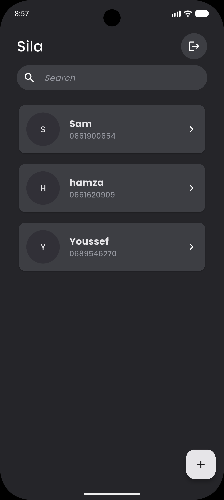
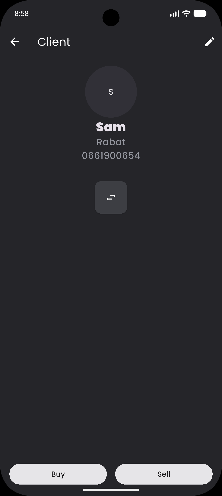
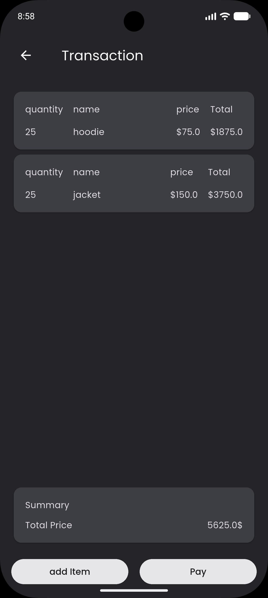
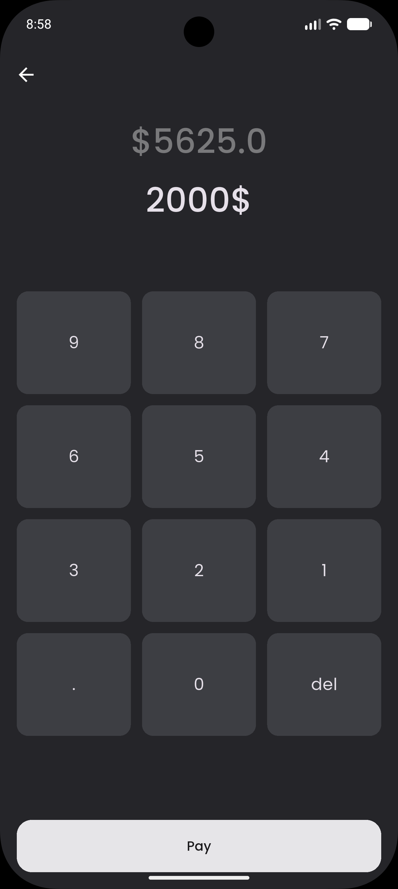
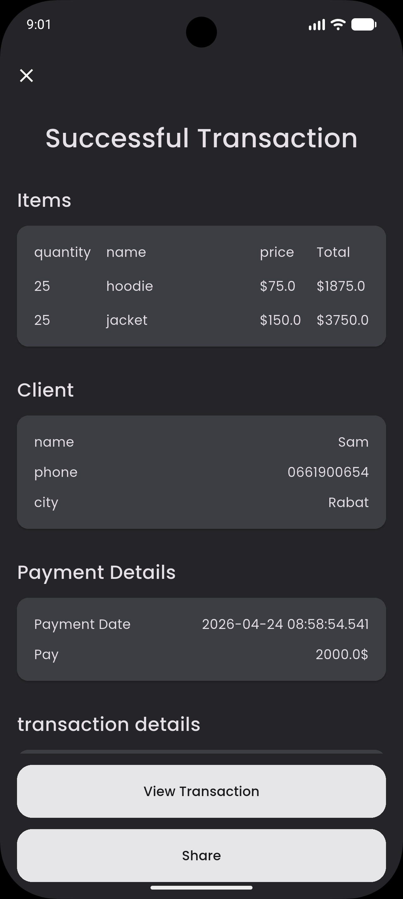
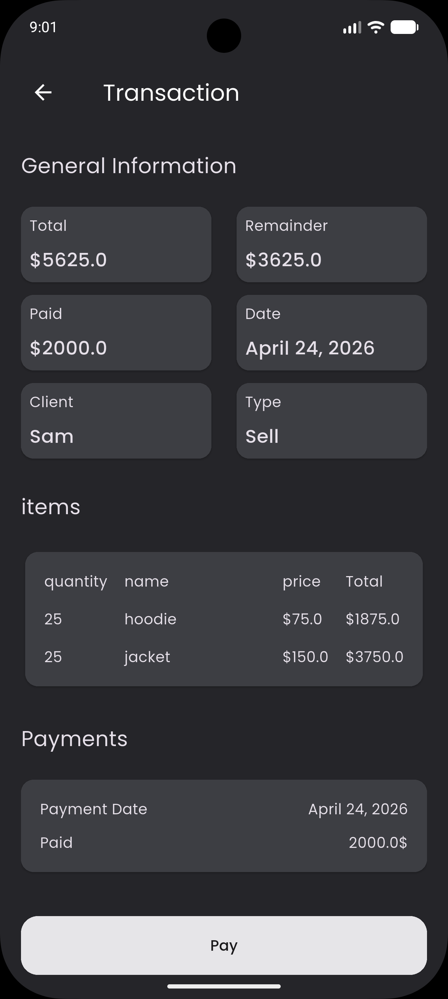

# 📱 Sila (Flutter)

A mobile-first app that helps wholesalers manage clients, track transactions, and monitor outstanding payments — built with Flutter and designed to work offline-first.

---

## 📸 Demo

---

## 💡 Problem

Wholesalers often rely on paper or scattered tools to track client transactions and payments.
This leads to:

* Lost information
* Poor tracking of debts
* Difficulty managing multiple clients

---

## ✅ Solution

This app provides a simple mobile solution to:

* Manage clients
* Record transactions
* Track payments over time
* See exactly how much each client owes

All in one place, directly from a phone.

---

## ✨ Features

* 👤 Create and manage clients
* 🧾 Create transactions per client
* ➕ Add items manually (name, price, quantity)
* 💰 Record partial or full payments
* 📊 View transaction summaries:
  * Total amount
  * Total paid
  * Remaining balance
* 🔁 Continue payments on existing transactions
* 📱 Offline-first experience
* 🔐 Authentication with Firebase

---

## 🛠 Tech Stack

* **Flutter (Dart)**
* **Firebase Authentication**
* **Django Rest Framework (Django)**

---

## 🏗 Architecture

The app follows a clean structure inspired by MVVM:

* **View** → Flutter UI
* **ViewModel** → State management using Riverpod
* **Model** → Local data persisted with SQLite (sqflite)

This separation makes the app easier to maintain and scale.

---

## 📚 What I Learned

* Designing an offline-first mobile experience
* Managing complex state in Flutter
* Handling incremental payments and transaction updates
* Structuring a scalable Flutter app
* Working with Firebase Authentication

---

## 🔮 Future Improvements

* Sync data with a backend (e.g. Django API)
* Add cloud backup & restore
* Improve UI/UX design
* Add analytics (sales, best clients, etc.)
* Export invoices or transaction history

---

## ⚠️ Status

🚧 This project is still in progress.
Core features are implemented, but improvements and refinements are ongoing.

---

## 📬 Contact

* Email: [mail](mailto:oussama.akerkaou11@gmail.com)
* LinkedIn: [profile](https://www.linkedin.com/in/oussama-a-18a095269/)

---
